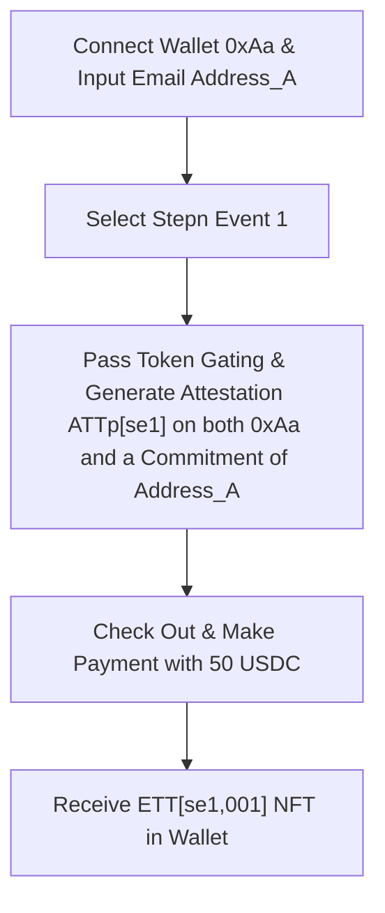
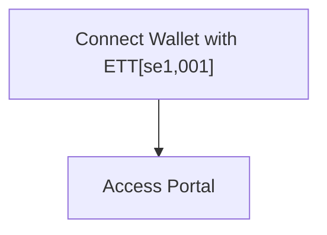
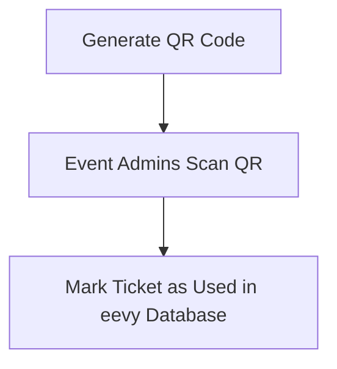
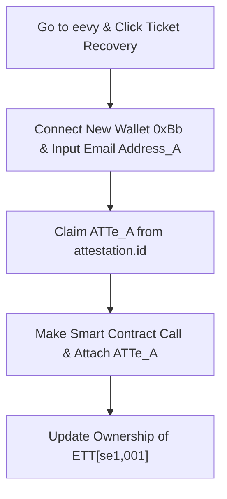
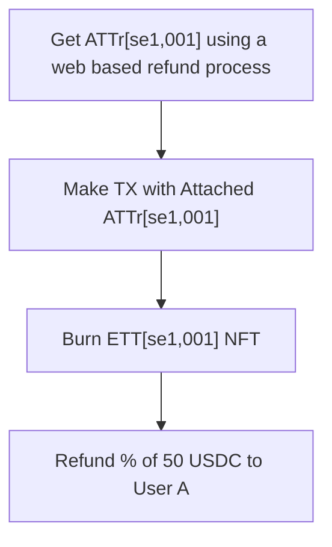
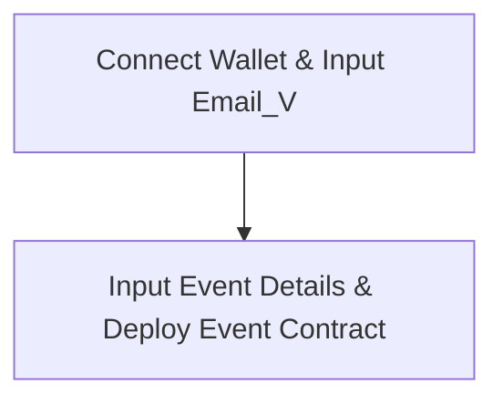
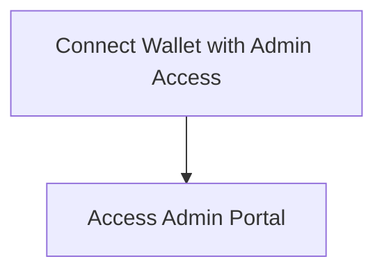
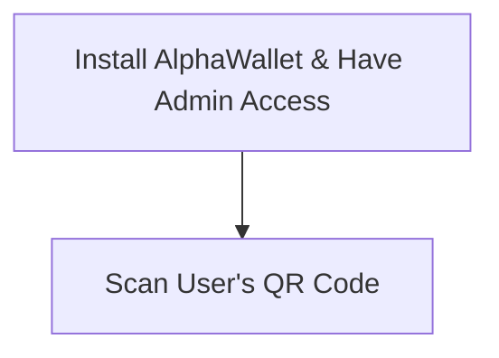
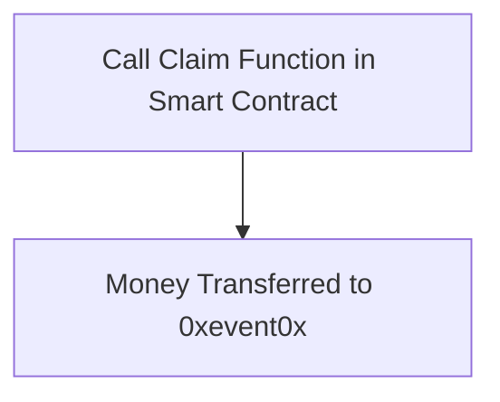
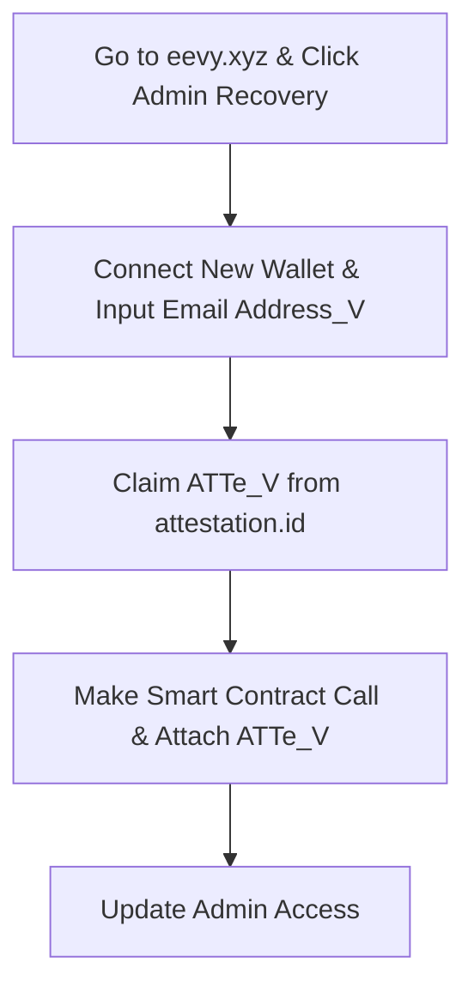

## For Users:

### 1. Buy Ticket from Stepn Event 1 (se1) Flow:

This flow represents the process a user goes through to purchase a ticket for an event.

### 2. Access User Portal:

This flow shows how a user accesses the portal after purchasing a ticket.

### 3. Using Ticket at the Event Venue:

This flow demonstrates how a user uses their ticket at the event venue.

Note that the event venue must be connected to the public blockchain to check if the key in the QR code is a holder of ETT token. The eevy Database is not on chain. The QR code is the Ethereum address as well as the signed current time, so it can change once a few seconds.

### 4. Ticket Recovery:

This flow outlines the steps a user takes to recover their ticket. Note that this flow is slightly incorrect as the key leading to the Pederson Commitment of `Address_A` is not mentioned. Will fix soon.

### 5. Transfer/Resell:

This is a standard NFT transfer or resale process with an added attestation-based DvP and potential royalty.

### 6. Refund:

This flow depicts the process a user follows to get a refund.

### 7. Get eevy token (EVT):

This process is still to be confirmed (TBC). It involves getting attestations from eevy and then claiming EVT from a smart contract using those attestations.

## For Event Organizer:

### 1. Create Stepn Event 1 (se1) Flow:

This flow represents the process an event organizer follows to create an event.

### 2. Access Admin Portal:

This flow shows how an event organizer or admin accesses the admin portal.

### 3. Check-in Users at Venue:

This flow demonstrates how event organizers or admins check in users at the event venue.

### 4. Claim Money:

This flow outlines the steps an event organizer or admin takes to claim money after the event.

### 5. Admin Recovery:

This flow depicts the recovery process for event organizers or admins.

### 6. Get eevy token (EVT):

Similar to the user flow, this process is still to be confirmed (TBC). It involves getting attestations from eevy and then claiming EVT from a smart contract using those attestations.
